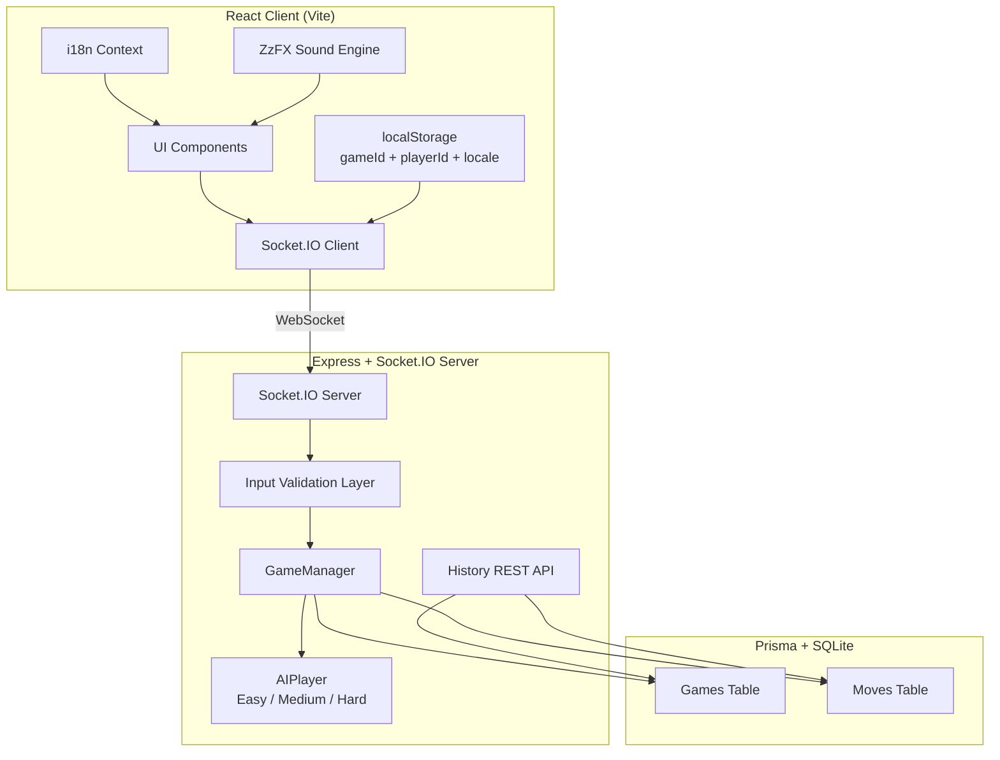
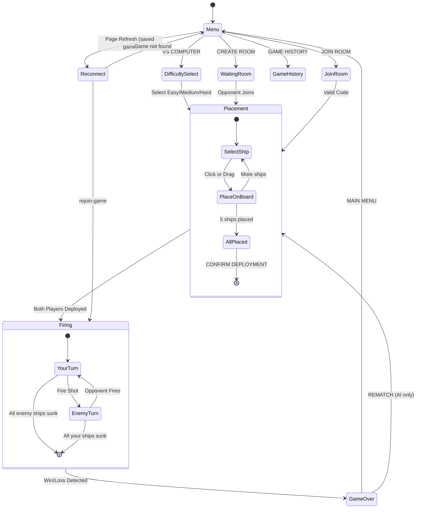
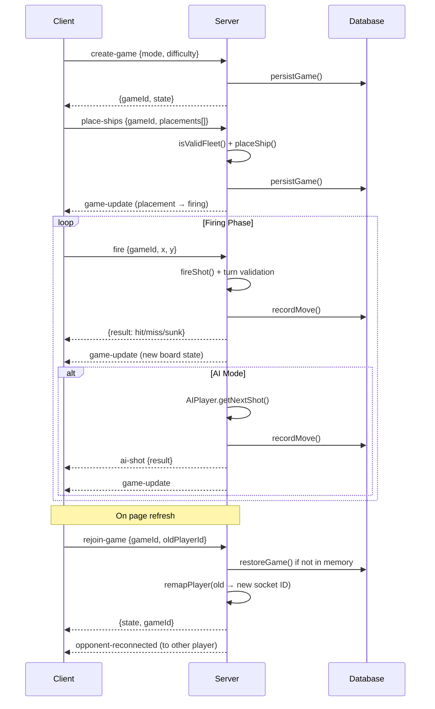
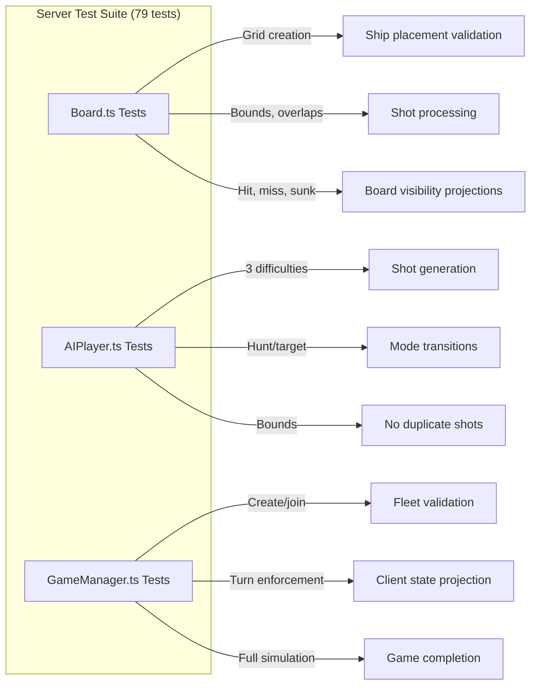

# Battleship - Build Writeup

## Table of Contents
- [Tech Stack](#tech-stack)
- [Architecture Overview](#architecture-overview)
- [Game Flow](#game-flow)
- [Requirements Checklist](#requirements-checklist)
- [Technical Decisions & Trade-offs](#technical-decisions--trade-offs)
- [Anti-Cheat: Attack Vectors & Defenses](#anti-cheat-attack-vectors--defenses)
- [Scalability Analysis](#scalability-analysis)
- [Testing Strategy](#testing-strategy)
- [Spike: AI Strategy Engine](#spike-ai-strategy-engine)
- [How I Used AI Tools](#how-i-used-ai-tools)

---

## Tech Stack

| Layer | Technology | Why |
|-------|-----------|-----|
| Frontend | React 19, TypeScript, Vite | Type safety, fast HMR, modern React features |
| Styling | Tailwind CSS v4, Framer Motion | Utility-first CSS for rapid iteration; physics-based animations |
| Ship Visuals | Custom SVG rendering (`ShipSVG.tsx`) | Per-ship silhouettes with turrets, bridges, flight decks — vector-based, no image assets |
| Sound Effects | ZzFX (game audio synth library) | 1KB library with 20-parameter sound synthesis — bomb impacts, water splashes, sinking sequences |
| i18n | Custom React Context + translations | 5 languages (EN, ES, KO, JA, ZH), auto-detects browser locale, persisted to localStorage |
| Real-time | Socket.IO | WebSocket abstraction with fallback to polling, rooms, ack callbacks |
| Backend | Express, Node.js, TypeScript | Lightweight HTTP + WebSocket server, shared types with client |
| Database | Prisma ORM + SQLite | Type-safe queries, auto-migrations, zero-infrastructure persistence |
| Testing | Vitest (unit), Playwright (e2e) | Fast unit tests for server logic; browser-based e2e for client flows |
| Deployment | Render | Free tier, auto-deploy from GitHub, supports Node web services |

---

## Architecture Overview



**Server-authoritative model**: The server owns all game state. The client is a pure rendering layer that receives projections of the game state — your own board (full visibility) and the opponent's board (only discovered hit/miss cells). Ship positions are never sent to the client until revealed through gameplay. All validation (placement, shots, turns) happens server-side.

---

## Game Flow



### Socket Event Flow



---

## Requirements Checklist

### Core Gameplay

| Requirement | Status | Implementation |
|-------------|--------|----------------|
| Complete, rules-correct Battleship | **Done** | 10×10 grid, 5 ships (Carrier-5, Battleship-4, Cruiser-3, Submarine-3, Destroyer-2), turn-based firing, hit/miss/sunk, win detection. All logic in `GameManager.ts` and `Board.ts`. |
| Ship placement with rotate + validate | **Done** | Click-to-place with hover preview, drag-and-drop from fleet panel to board, R key or button to rotate, free ship selection (any order), randomize, clear all. Server validates exact fleet composition, no overlaps, within bounds. |
| Firing phase with both boards visible | **Done** | "ENEMY WATERS" (opponent grid, click to fire) + "YOUR FLEET" (your board with SVG ship silhouettes and incoming hits). Targeting reticle on hover. All 10 rows fully interactive. |
| Hit/miss/sunk feedback | **Done** | Animated notification banner (DIRECT HIT! / MISS / [Ship] SUNK!), ZzFX sound effects (bomb explosion on hit, water splash on miss, multi-layer sinking sequence on sunk), CSS fire/smoke/ember animations on the board, SVG ship silhouettes revealed for sunk enemy ships. |
| Win detection + rematch/menu | **Done** | VICTORY/DEFEAT screen with animated glow + victory fanfare, REMATCH button (restarts with same difficulty for AI), MAIN MENU button. |

### Game Modes

| Requirement | Status | Implementation |
|-------------|--------|----------------|
| vs. AI (single-player) | **Done** | 3 difficulty levels: Easy (random), Medium (hunt/target with checkerboard pattern), Hard (probability density analysis). AI ships placed randomly with retry logic ensuring complete fleet. |
| AI "at least moderately intelligent" | **Done** | Medium mode uses hunt/target with adjacent cell probing after hits. Hard mode uses probability density — the same algorithm used by competitive Battleship solvers. See [Spike section](#spike-ai-strategy-engine). |
| vs. Human (multiplayer, real-time) | **Done** | CREATE ROOM generates a shareable code. JOIN ROOM with code. Socket.IO broadcasts game-update to both players on every action. |

### Hosting

| Requirement | Status | Implementation |
|-------------|--------|----------------|
| Deployed to public URL | **Done** | https://sentience-battleship.onrender.com/ — Render free tier, auto-deploys from GitHub. |
| GitHub repository | **Done** | Full monorepo with client/, server/, shared types, tests. |

### Persistence

| Requirement | Status | Implementation |
|-------------|--------|----------------|
| Game state survives page refresh | **Done** | `localStorage` stores gameId + playerId. On reconnect, client emits `rejoin-game`. Server restores from Prisma if not in memory, remaps old socket ID to new. AI state reconstructed from board state. Opponent notified via `opponent-reconnected` event (clears disconnect banner). |
| Completed game history stored + queryable | **Done** | Every move persisted with player, coordinates, result, timestamp. `GET /api/games` lists finished games. `GET /api/games/:id` returns full move sequence. UI has "BATTLE LOG" with click-through to move-by-move replay. |

### Internationalization

| Requirement | Status | Implementation |
|-------------|--------|----------------|
| Language-agnostic UI | **Done** | 5 languages: English, Spanish (Español), Korean (한국어), Japanese (日本語), Chinese (中文). Custom i18n system via React Context. Auto-detects browser locale, persists choice to localStorage. All user-facing strings use `t()` translation function. Language selector visible on every screen. |

### Considerations

| Requirement | Status | Implementation |
|-------------|--------|----------------|
| How can a player cheat? | **Done** | See [Anti-Cheat section](#anti-cheat-attack-vectors--defenses) — 6 attack vectors identified with corresponding defenses. |
| Runtime complexity at scale | **Done** | See [Scalability section](#scalability-analysis) — analysis of board size, concurrent games, and database scaling. |

### Testing

| Requirement | Status | Implementation |
|-------------|--------|----------------|
| Unit tests | **Done** | 79 tests across Board, AIPlayer, GameManager covering placement, shooting, turn management, AI behavior, win conditions, edge cases, input validation. |
| E2E tests | **Done** | 9 Playwright tests covering menu rendering, AI game flow, ship placement, firing on all rows (including row 10), no 3D transforms in DOM, game history, board labels. |

### UI/UX Polish

| Feature | Implementation |
|---------|----------------|
| SVG Ship Silhouettes | Custom vector ships with per-type details (turrets, bridges, flight decks, periscopes). Color-coded per ship type with glow effects. |
| Drag-and-Drop Placement | Drag ships from fleet panel to board, drag placed ships to reposition. Hover feedback for valid/invalid cells. |
| Animated Effects | CSS fire/smoke on hit cells, water splash ripples on misses, glowing embers on sunk ships. Framer Motion for transitions. |
| Sound Effects | ZzFX synthesized audio — bomb impact on hit, water splash on miss, multi-stage sinking sequence (explosion + metal groan + water rush). |
| Mobile Responsive | Adaptive cell sizing (28px on mobile, 36px on desktop), responsive flex layouts, touch-friendly controls. |
| Accessibility | `prefers-reduced-motion` support, `aria-label` on grid cells, AudioContext auto-resume for browser autoplay policies. |

---

## Technical Decisions & Trade-offs

### Why SQLite over PostgreSQL?

**Decision**: SQLite via Prisma.

**Rationale**: For a single-server deployment with low concurrent write volume, SQLite provides the persistence guarantees needed (game history, crash recovery) with zero infrastructure overhead. The database is a single file that ships with the server.

**Trade-off**: SQLite on Render's ephemeral filesystem means data is lost on redeploy. For production:
1. Use Render's persistent disk, or
2. Swap to PostgreSQL (one-line change in `schema.prisma`).

Prisma makes this swap trivial because the ORM abstracts the driver.

### Why Socket.IO over raw WebSockets?

**Decision**: Socket.IO for real-time communication.

**Rationale**: Socket.IO provides room management (each game is a room), acknowledgment callbacks (client gets confirmation of each action), automatic reconnection, and polling fallback. These features would require significant custom code with raw WebSockets.

**Trade-off**: Larger client bundle (~50KB gzipped) vs raw WS. Acceptable for this use case.

### Why in-memory state + DB backup (not DB-primary)?

**Decision**: Active games live in a `Map<string, GameState>` in server memory. Prisma persists snapshots asynchronously.

**Rationale**: Battleship has rapid state transitions (multiple shots per second in AI games). In-memory state gives O(1) access for active games.

**Trade-off**: Server restart loses in-memory state. Mitigated by DB-backed `restoreGame()` which reconstructs game state and AI targeting state from the persisted board. Not suitable for multi-server horizontal scaling without Redis.

### Why SVG ships over CSS/images?

**Decision**: Custom SVG components rendered at runtime with per-ship hull paths, details (turrets, bridges, flight decks), and color themes.

**Rationale**: Initial implementation used CSS 3D transforms with `rotateX()` perspective tilts. This caused click-target failures on lower grid rows due to overlay pointer-event interception. SVG with `pointer-events: none` as an overlay solves this completely while providing detailed ship visuals that scale to any cell size.

**Trade-off**: More complex component code than simple CSS shapes. The visual quality and interactivity gain justify it.

### Why ZzFX over audio files?

**Decision**: ZzFX (1KB game audio synth library) for all sound effects.

**Rationale**: ZzFX provides 20-parameter sound synthesis specifically designed for game audio — producing realistic explosions, splashes, and impacts with zero external audio files to load, host, or deal with CORS/caching issues. Sounds are instant and procedurally generated.

**Trade-off**: Sounds are synthesized, not recorded. For this use case, the game-genre aesthetic fits well.

### Why custom i18n over react-i18next?

**Decision**: Lightweight custom i18n with React Context, ~200 lines.

**Rationale**: The app has a bounded string set (~80 keys). A full i18n library (react-i18next + i18next + language detection plugins) adds 40KB+ to the bundle and significant configuration overhead. The custom solution provides the same UX (auto-detect locale, persist choice, `t()` function with interpolation) at a fraction of the cost.

**Trade-off**: No pluralization rules, no ICU message format, no namespace splitting. These features are unnecessary for this scope.

---

## Anti-Cheat: Attack Vectors & Defenses

### 1. Inspecting opponent's board

**Attack**: Modified client reads ship positions from WebSocket messages.

**Defense**: `getVisibleBoard()` creates a projection where unhit cells show `hasShip: false` and `shipName: null`. Opponent ship health is sent only as sunk/not-sunk booleans (`opponentShipsSunk`), not exact HP. The history API excludes the raw `state` field via Prisma `select`.

### 2. Sending an invalid fleet

**Attack**: Modified client sends ships with wrong lengths, extra ships, or mismatched name/length pairs.

**Defense**: `isValidFleet()` validates: exactly 5 placements, each with a canonical ship name, correct length matching the name, valid orientation (`'horizontal'` | `'vertical'`), integer coordinates within bounds, no duplicate names. Server rebuilds the board from scratch and validates no overlaps via `placeShip()`.

### 3. Firing out of turn

**Attack**: Modified client sends fire events during the opponent's turn.

**Defense**: `fireShot()` checks `game.currentTurn !== playerId` and rejects with `null`.

### 4. Firing out of bounds or invalid coordinates

**Attack**: Modified client sends `x: 999` or `x: -1` or non-integer values.

**Defense**: `fireShot()` validates `Number.isInteger(x)`, `Number.isInteger(y)`, and `0 <= x,y < BOARD_SIZE` before grid access. The socket handler also validates `typeof data.x === 'number'`.

### 5. Crashing the server

**Attack**: Malformed payloads, missing callbacks, or event flooding.

**Defense**: Every socket handler wraps logic in `try/catch`, validates `typeof callback === 'function'`, and validates data shape before processing. Errors are logged and the client receives a generic error response.

### 6. Session hijacking via rejoin

**Attack**: Attacker knows a gameId and oldPlayerId, sends `rejoin-game` to steal another player's seat.

**Defense acknowledged**: The current implementation remaps player IDs on rejoin without session tokens. For production, a cryptographic session token stored in `localStorage` and validated server-side would prevent this. For this demo scope, the risk is accepted given ephemeral socket IDs and short-lived games.

---

## Scalability Analysis

### Board size: What if the board was huge?

| Component | Current (10×10) | 100×100 | 1000×1000 |
|-----------|----------------|---------|-----------|
| Shot validation | O(1) | O(1) | O(1) |
| AI Easy (random) | O(N²) scan | O(N²) = 10K | O(N²) = 1M |
| AI Hard (probability) | O(S × N² × 2) | ~200K ops | ~10M ops |
| Board render | 100 DOM nodes | 10K nodes | 1M nodes (needs virtualization) |
| Persistence | ~2KB JSON | ~200KB | ~20MB |

**Mitigations for large boards**:
- AI: Incremental density updates instead of full recalculation. Spatial partitioning for hit adjacency.
- Rendering: Virtual grid (only render visible viewport cells). Canvas or WebGL for very large boards.
- `BOARD_SIZE` is a single constant — changing it scales all logic automatically.

### Concurrent games

Games are stored in a `Map` with automatic TTL-based cleanup (2-hour expiry, checked every 10 minutes). Memory scales linearly: ~50KB per active game.

For horizontal scaling: move game state to Redis with pub/sub for cross-server broadcasts. Prisma already handles the persistence layer, so the DB can be swapped to PostgreSQL for concurrent writes.

---

## Testing Strategy

### Unit Tests (79 tests, Vitest)



- **Board.ts** — Grid creation, ship placement validation (bounds, overlaps, edges), random fleet placement, shot processing (hit, miss, sunk, allSunk, duplicate, out-of-bounds), board visibility.
- **AIPlayer.ts** — Shot generation for all 3 difficulties, bounds checking, no duplicate shots, hunt/target transitions, adjacent cell targeting, sunk ship cleanup, checkerboard pattern.
- **GameManager.ts** — Game creation (AI/multiplayer), joining, fleet validation (incomplete, duplicate names, wrong lengths, out-of-bounds, non-integer coords, invalid orientation), shot firing (turn enforcement, bounds, duplicates), AI response, client state projection, disconnect handling, full game simulation.

### E2E Tests (9 tests, Playwright)

- Main menu renders with all options
- VS COMPUTER shows difficulty selection
- AI game reaches placement phase with correct UI
- Randomize places all ships and shows CONFIRM button
- Full AI game flow: placement → firing → shots register on all rows including row 10
- No 3D perspective transforms exist in the DOM (regression test)
- Game history page loads without crash
- Board has row labels (1-10) and column labels (A-J)

### Running Tests

```bash
# Unit tests
cd server && npm test

# E2E tests (requires dev servers running)
npx playwright test
```

---

## Spike: AI Strategy Engine

I chose the AI as my spike because competitive Battleship has well-studied optimal play, and implementing the algorithm hierarchy (random → hunt/target → probability density) demonstrates both algorithmic thinking and practical game design.

### Three difficulty tiers


| Level | Algorithm | Behavior |
|-------|-----------|----------|
| Easy | Uniform random | Picks any unshot cell. Feels fair for casual play. |
| Medium | Hunt/Target | Checkerboard hunt pattern (skips cells that can't contain the smallest remaining ship). On hit, probes all 4 adjacent cells. On sunk, clears target queue, re-evaluates remaining hits. |
| Hard | Probability density | For each remaining ship, enumerates every valid placement on the current board. Each unshot cell gets a score = number of possible placements passing through it. Fires at the highest-probability cell. In target mode, combines density with hit adjacency. |

The Hard AI uses the same core algorithm as competitive Battleship solvers (Donald Knuth's approach). Runtime is O(S × N² × 2) per shot — trivial for 10×10 but the asymptotic analysis matters if the board scales.

---

## How I Used AI Tools

I used **Cursor with Claude** as my primary development tool throughout this project.

**Where AI excelled**:
- **Scaffolding** — Project structure, Prisma schema, Express + Socket.IO boilerplate, Tailwind config. AI generated 80%+ of this correctly on first pass.
- **Systematic auditing** — AI read every file and reported bugs, security gaps, edge cases. This identified issues I would have missed (e.g., ship overlay intercepting grid clicks, `opponentShipHealth` leaking exact HP).
- **Test generation** — Comprehensive unit and e2e test suites, covering edge cases and boundary conditions.
- **i18n translations** — AI generated translations for 5 languages from the English source strings, which were then reviewed.
- **SVG ship rendering** — AI generated the hull paths and detail elements for 5 ship types based on my visual direction.

**Where I directed the work**:
- **Architecture** — The server-authoritative design, state projection model, and anti-cheat strategy were deliberate choices I made.
- **AI algorithm design** — I chose the probability density approach based on competitive Battleship literature and guided the three-tier difficulty system.
- **UX decisions** — The drag-and-drop placement, SVG ship aesthetic, sound design choices, and i18n approach were my creative direction.
- **Quality bar** — I drove the hardening pass: socket event validation, fleet composition checks, data leak prevention, memory cleanup. The AI executed, but I defined "production-ready."
- **Bug diagnosis** — I identified the row 6+ click failures and directed the removal of 3D transforms as the root cause.

The collaboration was most productive when I treated AI as a fast executor that I directed with clear intent, rather than delegating entire decisions to it.
