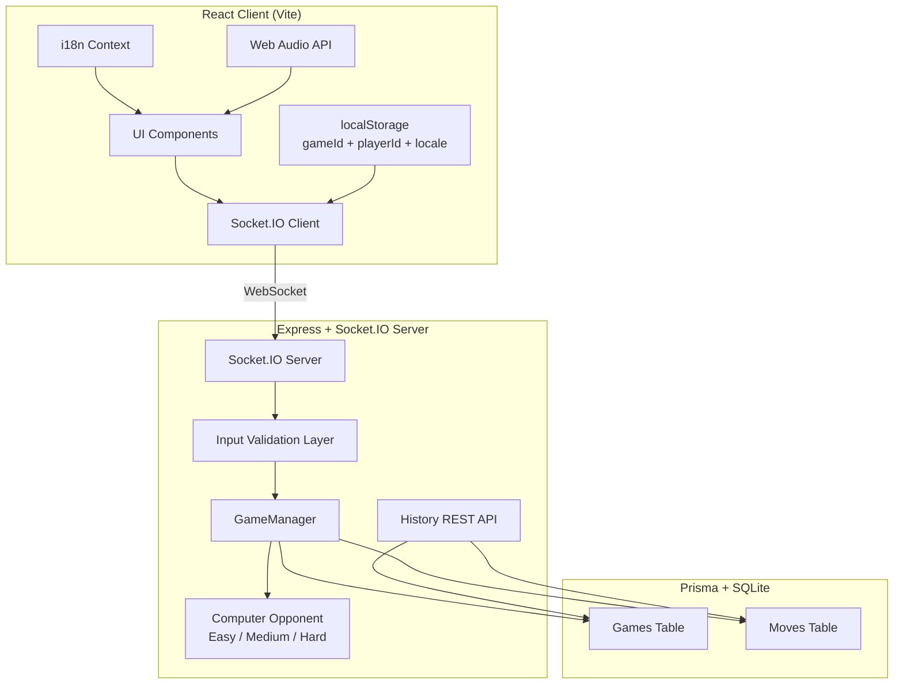
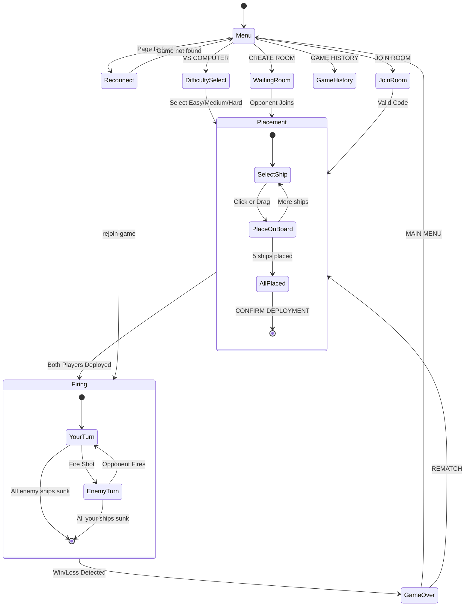

# Battleship — Build Writeup

## Table of Contents

- [What We're Building](#whats-the-goal)
- [Approach](#approach)
- [Tech Stack and Architecture](#tech-stack-and-architecture)
- [Requirements Coverage](#requirements-coverage)
- [Spike: UI/UX](#spike-uiux)
- [Considerations](#considerations)
- [Future Improvements](#future-improvements)

---

## What's the Goal

This is my submission for the Sentience Take Home Project. The ask is to build Battleship — a fully working, deployed web game with two modes, persistence, and a writeup covering how I approached it. Here's what the requirements break down to:

- **Core Gameplay** — A complete, rules-correct Battleship. Ship placement with rotation and validation, firing phase showing both boards with hit/miss/sunk feedback, win detection with rematch or menu.
- **Game Modes** — vs Computer (single-player, computer opponent needs to be at least moderately intelligent) and vs Human (real-time multiplayer, no manual refresh).
- **Hosting** — Deployed to a public URL.
- **Persistence** — Game state survives a page refresh. Completed games are stored with moves, outcome, and timestamps so they can be queried later. I need to pick a storage layer and explain why.
- **Considerations** — How can a player cheat and how do you prevent it? What happens to runtime complexity if the board gets huge?
- **Spike** — Something I'm uniquely excited about and skilled at. Mine is the UI/UX.

---

## Approach

I started by giving Cursor as much context as I could — the tech stack I'm familiar with, the full requirements, and what I was trying to build. I use Cursor as a pair programming partner. For any approach or architectural decision, I ask if there's an alternative that might be better and talk through tradeoffs before making the call myself.

After aligning on the architecture — server-authoritative model, React + Socket.IO + Express, Prisma with SQLite — I went with Render for deployment since it's free tier and can host my stack. I broke down the requirements with Cursor, listed out the components and server-side logic, and built it out piece by piece. Once the core game was working, it was about making the UI/UX actually solid — responsive layouts, drag-and-drop ship placement, sound effects, animations, and making sure it feels good to play on both desktop and mobile.

The core architectural decision was making the server own all game state. The client just renders what the server tells it — you never get the opponent's ship positions until you actually hit them. Everything flows through Socket.IO events. That one decision made anti-cheat, persistence, and multiplayer all way simpler because there's one source of truth.

---

## Tech Stack and Architecture

| Layer        | Technology                     | Why                                                                                 |
| ------------ | ------------------------------ | ----------------------------------------------------------------------------------- |
| Frontend     | React 19, TypeScript, Vite     | Type safety, fast HMR, what I know well                                             |
| Styling      | Tailwind CSS v4, Framer Motion | Utility-first for rapid iteration, physics-based animations                         |
| Ship Visuals | Custom SVG (`ShipSVG.tsx`)     | Vector-based ship silhouettes that scale to any cell size                           |
| Sound        | Web Audio API (oscillators)    | Zero dependencies, no audio files to load or host                                   |
| i18n         | Custom React Context           | 5 languages, auto-detects browser locale, ~80 strings total — didn't need a library |
| Real-time    | Socket.IO                      | Rooms, reconnection, ack callbacks out of the box                                   |
| Backend      | Express, Node.js, TypeScript   | Lightweight, shared types with client                                               |
| Database     | Prisma ORM + SQLite            | Type-safe queries, zero-infrastructure persistence                                  |
| Testing      | Vitest + Playwright            | Fast unit tests for server, browser-based e2e for client                            |
| Deployment   | Render                         | Free tier, auto-deploys from GitHub                                                 |

### Architecture

The server is the source of truth. The client sends actions through Socket.IO (place ships, fire shot, rejoin game), the server validates everything, updates state, and broadcasts back. The client never has access to anything it shouldn't — opponent ship positions, exact HP, nothing. It only gets a projection of the game state relevant to that player.

### Game Flow

### Key Technical Decisions

**Why server-authoritative?** Anti-cheat is basically free. The client can't cheat because it never has the data to cheat with. Persistence is simpler too — there's one state to save, not two.

**Why SQLite over Postgres?** This is a single-server deployment with low write volume. SQLite gives me everything I need with zero infrastructure — the database is literally a single file. If I ever needed to scale, swapping to Postgres is a one-line change in `schema.prisma` since Prisma abstracts the driver.

**Why Socket.IO over raw WebSockets?** I get rooms (each game is a room), ack callbacks, automatic reconnection, and polling fallback for free. Building all that on raw WebSockets would be a lot of custom code for no real benefit here.

**Why in-memory state + DB backup?** Active games live in a `Map<string, GameState>` in server memory for O(1) access. Shots happen fast, especially in computer games — I don't want to round-trip to the DB on every action. Prisma persists snapshots async so if the server restarts, `restoreGame()` reconstructs everything from the DB.

**Why custom i18n instead of react-i18next?** The app has about 80 translatable strings. A full i18n library adds 40KB+ to the bundle. My custom solution is ~200 lines, does locale detection, persistence, and a `t()` function. That's all I needed.

---

## Requirements Coverage

### Core Gameplay

**Rules-correct Battleship:** 10×10 grid, 5 ships (Carrier-5, Battleship-4, Cruiser-3, Submarine-3, Destroyer-2), turn-based firing, hit/miss/sunk detection, win condition. All game logic is server-side in `GameManager.ts` and `Board.ts`.

**Ship placement with rotation and validation:** Players can click to place, drag from the fleet panel, drag to reposition, press R to rotate, randomize all ships, or clear and start over. There's a hover preview (green = valid, red = invalid) and the confirm button only shows up when all 5 ships are placed. The server re-validates the full fleet on submit — correct names, correct lengths, no overlaps, within bounds.

**Firing phase with both boards visible:** Two boards shown side-by-side on desktop, stacked on mobile. "Enemy Waters" is where you click to fire — hits get fire animations, misses get water splash effects. "Your Fleet" shows your ships as SVG silhouettes with incoming hits shown as fire/smoke. After every shot there's an animated banner (DIRECT HIT / MISS / [Ship] SUNK) with sound effects via the Web Audio API. When you sink an enemy ship, its full silhouette gets revealed on the opponent grid.

**Win detection with rematch or menu:** When all ships of one player are sunk, it transitions to a victory/defeat screen with a Rematch button (same difficulty) and a Main Menu button.

### Game Modes

**vs Computer:** The requirement says "at least moderately intelligent." I built three algorithmic difficulty tiers — purely algorithmic opponents, not LLM-based. Each tier uses a fundamentally different search/targeting strategy.

```mermaid
graph TB
    subgraph Easy ["Easy: Uniform Random"]
        E1[Pick random unshot cell]
    end

    subgraph Medium ["Medium: Hunt and Target"]
        M1[Hunt Mode: Checkerboard pattern]
        M2[Hit detected]
        M3[Target Mode: Probe 4 adjacent cells]
        M4[Ship sunk — clear queue]
        M1 --> M2
        M2 --> M3
        M3 --> M4
        M4 --> M1
    end

    subgraph Hard ["Hard: Probability Density"]
        H1[For each remaining ship]
        H2[Enumerate all valid placements]
        H3[Score each cell by placement count]
        H4[Fire at highest-probability cell]
        H1 --> H2 --> H3 --> H4
        H4 -->|Target mode| H5[Combine density + hit adjacency]
    end
```

| Level  | Algorithm           | What it does                                                                                                                                                                                                                                                  |
| ------ | ------------------- | ------------------------------------------------------------------------------------------------------------------------------------------------------------------------------------------------------------------------------------------------------------- |
| Easy   | Uniform random      | Picks any unshot cell. Feels fair for casual play.                                                                                                                                                                                                            |
| Medium | Hunt/Target         | Checkerboard hunt pattern in hunt mode (skips cells that can't fit the smallest remaining ship). On hit, switches to target mode and probes all 4 adjacent cells. On sunk, clears the target queue and re-evaluates.                                          |
| Hard   | Probability density | For each remaining ship, enumerates every valid placement on the current board. Each unshot cell gets a score = number of possible placements passing through it. Fires at the highest-probability cell. In target mode, combines density with hit adjacency. |

The hard difficulty uses the same core algorithm as competitive Battleship solvers. The medium difficulty's hunt/target with checkerboard parity is what competitive human players actually do. These aren't just "random with different hit rates" — each tier is a fundamentally different algorithm that creates a meaningfully different play experience.

**vs Human (multiplayer):** Create Room generates a shareable code. Join Room with the code. Both players place ships independently, then the firing phase starts when both confirm. Socket.IO broadcasts `game-update` to both players on every action — no polling, no manual refresh. If someone disconnects, the opponent sees a banner. On reconnect, the client rejoins automatically via the `rejoin-game` event.

### Hosting

Live at: **https://sentience-battleship.onrender.com/**

Deployed on Render free tier, auto-deploys from GitHub. The server serves the built React client as static files and runs Socket.IO on the same port. Render free tier spins down after 15 minutes of inactivity so the first load might take ~30 seconds to cold start.

### Persistence

**Page refresh survival:** Works for both computer and multiplayer games. The client stores `gameId` and `playerId` in localStorage. On page load, if there's a saved game, it offers "Resume Game" or "Start Fresh." On resume, the client emits `rejoin-game` with the saved IDs. The server restores from Prisma if the game isn't in memory anymore, remaps the old socket ID to the new one. For computer games, the algorithmic opponent's state gets reconstructed from the board — it looks at which cells have been hit and rebuilds the target queue.

**Why localStorage for session data?** The `gameId` and `playerId` are just identifiers the client needs to reconnect — they're tiny, need to be instantly available on page load (no async), and are only relevant to that specific browser tab. Putting these in the DB would mean the client has no way to know _which_ game to ask for without a login system. localStorage is the right tradeoff here: it's synchronous, per-origin, survives refresh, and costs nothing. The actual game state still lives server-side — localStorage just holds the keys to get back to it.

**Game history storage:** Every completed game is persisted with full move history.

The schema (Prisma + SQLite):

- `Game` — id, mode, status, winner, state (JSON), createdAt, updatedAt
- `Move` — id, gameId, player, x, y, result (hit/miss/sunk), shipSunk, timestamp

Two API endpoints:

- `GET /api/games` — lists finished games with summary info
- `GET /api/games/:id` — returns the full game with the ordered move sequence

There's a Game History screen accessible from the main menu that shows the battle log.

**Why SQLite for game history (not localStorage)?** Game history needs to be durable, queryable, and shared across all clients — not tied to one browser. localStorage would mean your history disappears if you clear your browser or switch devices, and there'd be no way to query across all games server-side. SQLite gives me relational queries (joins between games and moves), persistence across deploys, and a single file with zero infrastructure. Prisma makes swapping to Postgres a one-line schema change if I needed concurrent writes later.

**Why in-memory + DB (not DB-primary) for active games?** Active games live in a `Map` for O(1) access. Shots happen fast — especially vs computer — and I don't want to round-trip to SQLite on every action. The DB is the durable backup: games get persisted async, and if the server restarts, `restoreGame()` reconstructs everything from the DB. The tradeoff is that a server crash mid-game could lose the last few seconds of state, but for this scope that's acceptable.

### Testing

**79 unit tests (Vitest):**

- `Board.ts` — grid creation, ship placement validation (bounds, overlaps, edges), random fleet placement, shot processing (hit, miss, sunk, allSunk, duplicate, out-of-bounds), board visibility projections
- `AIPlayer.ts` — shot generation for all 3 difficulties, bounds checking, no duplicate shots, hunt/target mode transitions, adjacent cell targeting, sunk ship cleanup, checkerboard pattern
- `GameManager.ts` — game creation, joining, fleet validation (incomplete fleet, duplicate names, wrong lengths, out-of-bounds, non-integer coords, invalid orientation), turn enforcement, computer response, client state projection, disconnect handling, full game simulation

**15 e2e tests (Playwright):**

- Menu renders with all options
- VS COMPUTER shows difficulty selection
- Computer game reaches placement phase
- Randomize places all ships and shows confirm button
- Full computer game flow: placement → firing → shots register on all rows including row 10
- No 3D perspective transforms in the DOM (regression test)
- Game history page loads
- Board has 10 row labels
- Board has column labels A–J
- Exit game button visible during placement and returns to menu
- Exit game button visible during firing phase and returns to menu
- Resume game prompt appears after exiting mid-game
- Start fresh clears saved game
- Language selector is visible and switches language

---

## Spike: UI/UX

Battleship is a well-known game — everyone knows the rules. So the challenge isn't explaining how to play, it's making the experience feel engaging enough that people actually want to keep playing. I wanted to go beyond just "it works" and make it feel like a real game. That's what I focused my spike on.

**SVG ships over CSS.** The original implementation used CSS 3D transforms with `rotateX()` for ship visuals. That looked fine but it broke click targets on lower grid rows — the overlay intercepted pointer events. I switched to custom SVG silhouettes with `pointer-events: none`, which solved the interaction problem and ended up looking way better. Each of the 5 ship types has its own vector silhouette with details like turrets, bridges, flight decks, and periscopes. They're color-coded per type with glow effects, and since they're vector-based they scale to any cell size without quality loss.

**Drag-and-drop ship placement.** You can drag ships from the fleet panel onto the board, drag placed ships to reposition them, or just click to place. There's a hover preview — green for valid, red for invalid. Rotate with R, randomize all ships, or clear and start over. I wanted placement to feel intuitive, not like filling out a form.

**Animated combat feedback.** Hits show fire and smoke animations on the board. Misses show water splash ripples. Sunk ships get a glowing ember effect. When you sink an enemy ship, the full SVG silhouette gets revealed on their grid. There's also an animated notification banner after every shot — DIRECT HIT, MISS, or [Ship Name] SUNK. Framer Motion handles the transitions and entrance animations.

**Sound effects.** All sounds are synthesized in real-time using the Web Audio API (oscillators) — no audio files to load or host. Different tones for hits, misses, sinking sequences, ship placement, and a victory fanfare. It's subtle but it makes a big difference in the feedback loop. I went with Web Audio API over an audio library because it's zero dependencies and the sounds are instant.

**Responsive layout.** The game works on desktop and mobile. On desktop, boards sit side-by-side. On mobile, everything stacks in a column with full-width components. The grid cells use CSS `grid-cols-10` with `1fr` units and `aspect-ratio: 1/1` so they grow and shrink with the container — not fixed pixel sizes. Ship SVG overlays are positioned using a `ResizeObserver` that measures actual rendered cell dimensions, so they stay accurate at any screen size.

**i18n.** 5 languages (English, Spanish, Korean, Japanese, Chinese) with auto-detection of browser locale. The language selector lives on the main menu only — it doesn't clutter the game screens during play.

**Accessibility.** `prefers-reduced-motion` support for users who need reduced animations, `aria-label` on every grid cell for screen readers, and AudioContext auto-resume to handle browser autoplay policies.

The point was to take a game everyone already knows and make the whole experience feel polished — the visuals, the interactions, the feedback, the responsiveness. Not just functional, but actually enjoyable to use.

---

## Considerations

### How can a player cheat?

The main defense is the server-authoritative architecture — the client never has data it shouldn't. The server validates everything: fleet composition, shot coordinates, turn order, bounds. The opponent's board is sent as a projection where unhit cells always show `hasShip: false`. Ship health is only sent as sunk/not-sunk, not exact HP.

One thing worth noting: you can look at your hits on the opponent grid and make deductions about where ships might be. That's intentional — it's not cheating, it's working smart with the information you have. I thought it would be more fun to let players strategize from visible hits rather than keep everything ambiguous. Real Battleship works the same way.

### Runtime complexity — what if the board was huge?

Right now `BOARD_SIZE` is a single constant — changing it scales all the game logic automatically. If the board was bigger, I'd let the user choose their grid size before the game starts and reuse the same components. The computer opponent's probability density algorithm would need incremental updates instead of full recalculation per shot. For the frontend, larger boards would need viewport virtualization or Canvas rendering. For scaling concurrent games, I'd move game state to Redis for shared state across servers and swap SQLite to Postgres.

---

## Future Improvements

If I had more time, here's what I'd tackle next:

- **Session tokens for rejoin security.** Right now rejoin relies on gameId + playerId without cryptographic verification. Adding a signed token in localStorage validated server-side would close the session hijacking vector properly.
- **Multiplayer rematch.** Currently rematch only works for vs Computer games. For multiplayer, both players get sent to the menu. A proper rematch flow would create a new room and invite the opponent automatically.
- **Persistent disk or Postgres on Render.** SQLite on Render's ephemeral filesystem means game history gets wiped on redeploy. Either attach a persistent disk or swap to Postgres (one-line Prisma change) to make history truly durable.
- **Spectator mode.** Let other people watch a multiplayer game in progress. The server-authoritative architecture already supports this — it's just another socket joining the room with a read-only projection.
- **Replay system.** The move history is already stored with timestamps. Building a step-through replay viewer on top of the existing `GET /api/games/:id` endpoint would be straightforward.
- **Rate limiting.** The server validates inputs but doesn't throttle event frequency. Adding rate limiting on socket events would prevent spam/flooding in production.

